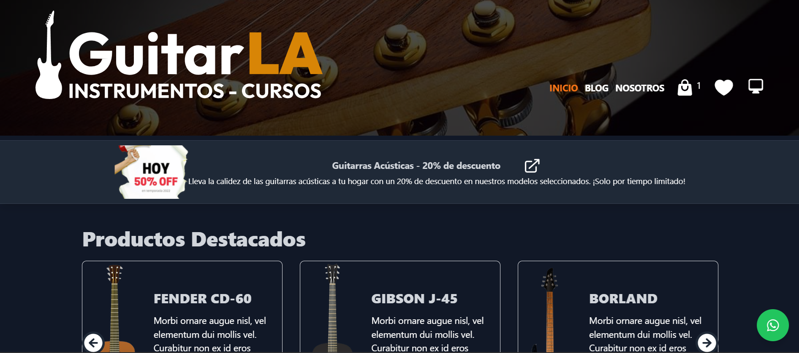

<!-- Banner -->


# 👋 ¡Hola! Gracias por visitar APP GUITARLA

## 🎸 APP GUITARLA - E-commerce de Guitarras

**APP GUITARLA** es una plataforma de ecommerce especializada en la venta de guitarras. Desarrollada con tecnologías modernas, ofrece una experiencia de compra intuitiva y segura para los amantes de la música. Además, cuenta con una sección de blog informativo y un carrusel automático en la página principal para mostrar descuentos y ofertas especiales.

## 🛠️ Tecnologías Utilizadas

- **React**: Librería para construir interfaces de usuario.
- **React Router DOM**: Manejo de rutas dentro de la aplicación.
- **Axios**: Cliente HTTP para realizar peticiones a la API.
- **Tailwind CSS**: Framework de CSS para estilizar la aplicación.
- **TypeScript**: Un superset de JavaScript que añade tipos estáticos.
- **Zod**: Librería de validación de esquemas para TypeScript.
- **Zustand**: Librería para manejar el estado global de la aplicación de manera eficiente.
- **HeadlessUI**: Componentes accesibles sin estilos predeterminados, facilitando la personalización.
- **React Loading Skeleton**: Muestra esqueletos de carga para mejorar la experiencia de usuario durante la carga de datos.
- **SweetAlert2**: Librería para mostrar alertas personalizadas y estilizadas.
- **Swiper**: Librería para implementar carruseles y sliders responsivos.
- **Heroicons**: Conjunto de iconos SVG listos para usar en proyectos React.


## 🎥 Demostración

Puedes ver una demostración en video de cómo funciona la aplicación en [este enlace de YouTube](https://www.youtube.com/watch?v=OPiSc6o85jY&t=11s).

## 🎥 Prueba la Aplicación

Puedes probar la aplicación en vivo visitando [este enlace en Netlify](https://guitarlastrapi.netlify.app/).

## 📝 Funcionalidades Principales

- **Visualización de Productos**: Los productos se muestran de manera organizada con categorías separadas para guitarras eléctricas y acústicas.
- **Carrusel de Ofertas**: Un carrusel automático en la página principal destaca descuentos y promociones actuales.
- **Sección de Blog**: Artículos y noticias relacionadas con el mundo de las guitarras y la música.
- **Guitarras Destacadas**: Gestión y visualización de guitarras destacadas para resaltar los productos más populares o en oferta.
- **Acceso con Slugs Dinámicos**: Cada guitarra tiene una URL amigable para mejorar el SEO y facilitar el acceso directo a los productos.
- **Navegación Mobile con Menú de Hamburguesa**: Una interfaz optimizada para dispositivos móviles con un menú de navegación tipo hamburguesa.
- **Modo Oscuro**: Opción para alternar entre modo claro y oscuro, mejorando la experiencia de usuario según sus preferencias.
- **Sección de Favoritos**: Los usuarios pueden marcar sus guitarras favoritas, almacenando esta información en el localStorage.
- **Carrito de Compras**: Añade productos al carrito y gestiona tus compras, con el carrito almacenado en el localStorage.
- **Pago Seguro con MercadoPago**: Integración con MercadoPago para realizar pagos de manera segura y eficiente.
- **Gestión de Productos**: Agregar y eliminar guitarras del carrito con confirmaciones para evitar errores accidentales.

## 📂 Estructura del Proyecto

```bash
src/
├── components/       # Componentes reutilizables
├── helpers/          # Funciones utilitarias y helpers
├── img/              # Imagenes de la aplicación
├── layouts/          # Layout principal
├── services/         # Configuración de Axios y lógica de conexión a la API
├── stores/           # Configuración de Zustand para el manejo de estado
├── types/            # Definiciones de tipos para TypeScript
└── views/            # Páginas de la aplicación
```
## 🚀 Cómo Empezar
1. Clona el repositorio:

```bash
git clone https://github.com/RodrigoLoboDev/FRONTEND_GUITARLA
```
2. Instala las dependencias:

```bash
npm install
```

3. Inicia el servidor de desarrollo:

```bash
npm run dev
```

## 🤝 Contribuciones
Las contribuciones son bienvenidas. Si tienes ideas para mejorar el proyecto, no dudes en abrir un issue o hacer un pull request.

## 📧 Contacto
- Email: rolobo2812@gmail.com
- LinkedIn: [Jesús Luis Rodrigo Lobo](https://www.linkedin.com/in/jes%C3%BAs-luis-rodrigo-lobo-6594a81b4/)
- GitHub: [RodrigoLoboDev](https://github.com/RodrigoLoboDev)

#### ⭐️ Si te gusta lo que hago, no dudes en seguirme y contribuir a mis proyectos. ⭐️